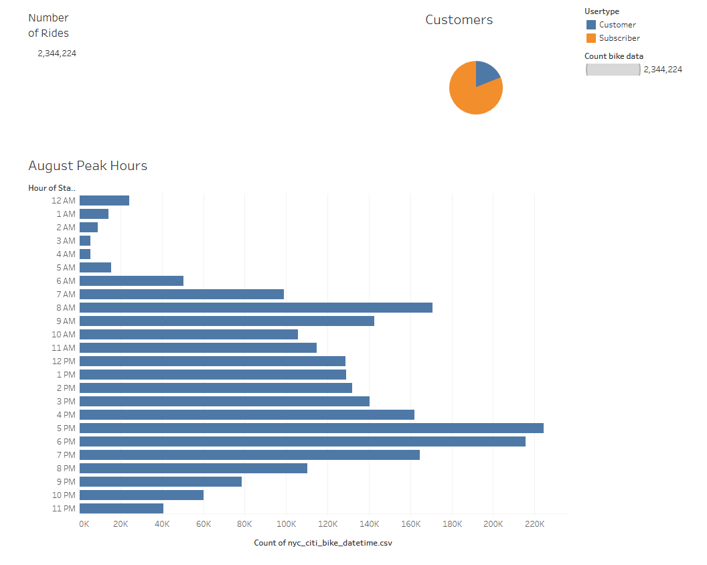
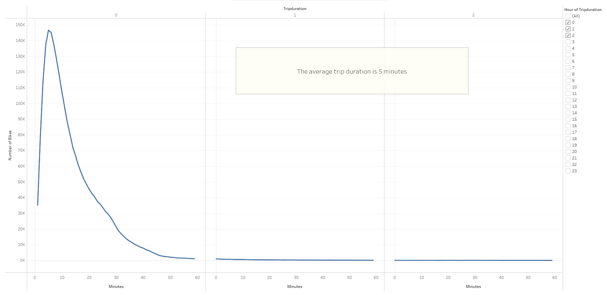
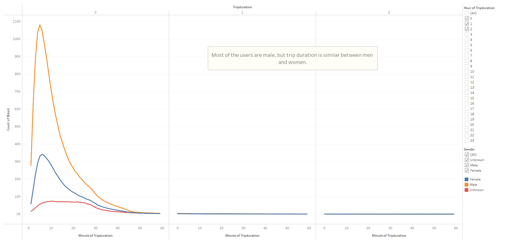
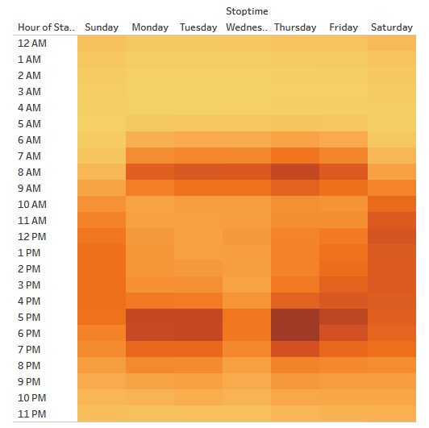
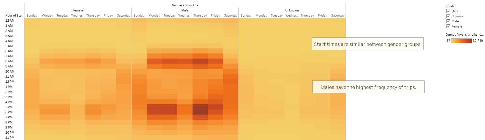
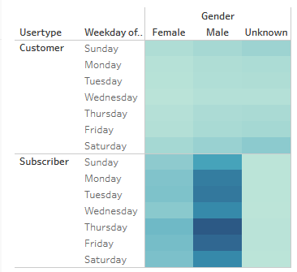

# bikesharing

# NYC CitiBike

## Overview

### Purpose

- The purpose of this project is to create a data visualization with Tableau for bike sharing program in New York City.

= Starting with only a .csv file, we can create a visual story for audiences to absorb with clear graphics and informative text.

- With this, one could easily create a business proposal substantiated by our data.

The Tableau story of the NYC CitiBike can be found in the following link:
[https://public.tableau.com/app/profile/chris.williams8057/viz/NYCCitiBikeStory_16550670127240/NYCStory](https://public.tableau.com/app/profile/chris.williams8057/viz/NYCCitiBikeStory_16550670127240/NYCStory "link to dashboard")

## Results

### General Information

TESTING IMAGES

- TEXT GOES HERE

### Checkout Time for Users

TESTING IMAGES

- TEXT GOES HERE

### Checkout Time per Gender

TESTING IMAGES

- TEXT GOES HERE

### Trips by Weekday per Hour

TESTING IMAGES

- TEXT GOES HERE
- 
### Trips by Gender (Weekday per Hour)

TESTING IMAGES

- TEXT GOES HERE

### User Trips by Gender by Weekday

- This graph tells us the number of trips by weekday, comparing subscribers and customers, as well as comparing gender.

- The graph has weekdays and user type on y-axis and gender on x-axis.

- Females have a similar distribution of trips when compared to makes, but show significantly lower number of trips than males.

- Amongst subscribers, males have the highest number of trips especially on Thursdays and Fridays.
